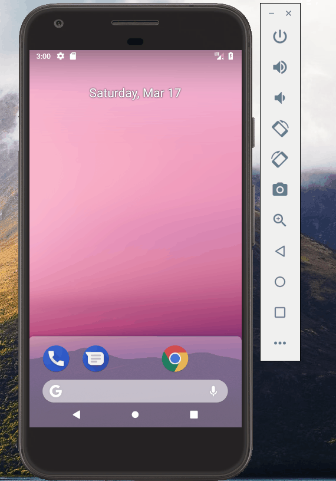

# A Simple And Good WeatherApp
> Goal: to create a useful and convinient Weather App

version 1.2: 
  - 1.adding the new icon to the application, 
  - 2.adding the blue background, 
  - 3.adding the refresh button, 
  - 4.when the refresh button is pressed, the temperature, the date and the day of the week are all updated.

> The App Screenshots:

